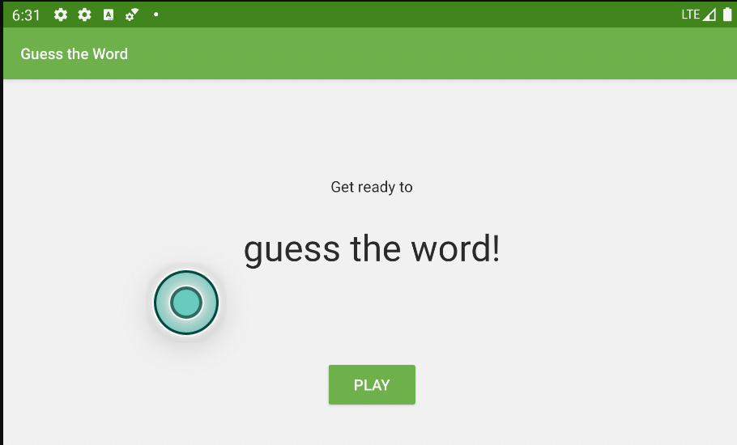

# Guess it
## Описание
Игра - объясни слово напарнику
## Цель
Изучить шаблон проектирования MVVM и ViewModel
## Использовано
1. ViewModel
2. DataBinding
3. MVVM
4. LiveData
5. Android studio
6. Git
## Внешний вид

